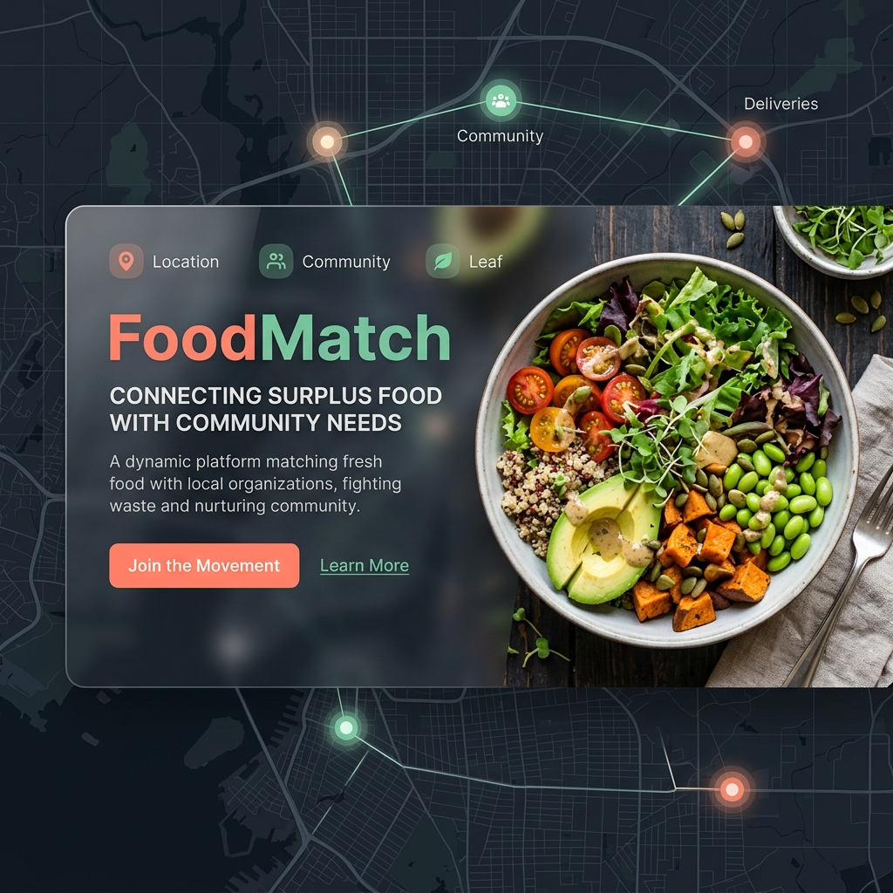

<div align="center">
  
  
  <h1>🍲 FoodMatch</h1>
  <p><i>Real-time, Location-based Food Rescue Engine</i></p>

  <p>
    
    
    
    
    
  </p>
</div>

---

## 🌟 Overview

**FoodMatch** is a mission-driven SaaS platform designed to bridge the gap between surplus food sources and those in need. Built with a focus on **real-time transparency** and **community trust**, it transforms food donation from a static chore into a dynamic, location-aware rescue operation.

### 🚀 Key Features

| Feature | Description |
| :--- | :--- |
| **🛰️ Live Radar Map** | Real-time interactive map showing nearby food drops within a 5km radius. |
| **🍱 Unified Dashboards** | Sleek, professional list containers for managing donations and claims with zero clutter. |
| **⏳ Smart Expiry** | Automatic filtering system that ensures only fresh, safe food is visible to receivers. |
| **🛡️ Trust Scores** | Community-driven rating system to build accountability and highlight heroic donors. |
| **🔐 Secure Pickup** | 4-Digit PIN verification system to ensure donations reach the right hands. |
| **📧 Smart Alerts** | Instant email notifications powered by Resend when food is posted in your area. |

---

## 🛠️ Tech Stack

- **Framework**: [Next.js 15+](https://nextjs.org/) (App Router)
- **Database**: [Neon PostgreSQL](https://neon.tech/) (Serverless Cloud DB)
- **ORM**: [Prisma](https://www.prisma.io/)
- **Auth**: [Clerk](https://clerk.com/) (Secure Multi-factor Auth)
- **Email**: [Resend](https://resend.com/) (Transactional Notification Engine)
- **Styling**: Vanilla CSS with Glassmorphism & Framer Motion
- **Icons**: [Lucide React](https://lucide.dev/)

---

## 📦 Getting Started

### 1. Prerequisites
- Node.js 18+ 
- A Neon.tech (PostgreSQL) account
- A Clerk project
- A Resend API key

### 2. Installation
```bash
# Clone the repository
git clone https://github.com/yourusername/foodmatch.git

# Install dependencies
npm install

# Setup Environment Variables
cp .env.example .env.local
```

### 3. Database Initialization
```bash
npx prisma generate
npx prisma db push
```

### 4. Run Development
```bash
npm run dev
```

---

## 🤝 Community & Trust
FoodMatch is built on the belief that transparency creates impact. Our **Donor Verification** and **Rating System** ensure that every rescued meal is a step toward a zero-waste community.

---

<div align="center">
  <p>Built with ❤️ by the FoodMatch Community</p>
  <p><i>Saving the world, one meal at a time.</i></p>
</div>
